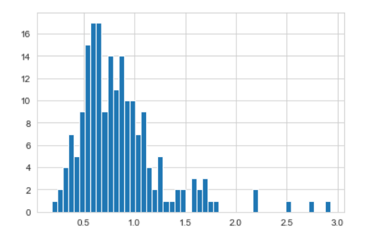
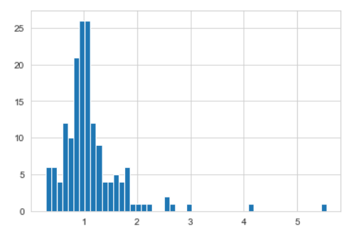

# Project One - Write a Data Science Blog Post

A Medium post was written based on this project. If you are interested, please check 
https://istoia9.medium.com/this-will-bring-you-insights-about-airbnbs-business-in-the-united-states-2288d932bbe2

### File Structure
    - boston
	| - calendar.csv
	| - listings.csv
	| - reviews.csv

	- seattle
	| - calendar.csv
	| - listings.csv
	| - reviews.csv

	- airbnb_boston_seattle_analysis.ipynb
	- README.md

### Python Libraries
- pandas
- numpy
- matplotlib.pyplot
- seaborn

### Business Understanding
In this project, an exploratory data analysis was performed using public datasets - namely, Seattle and Boston Airbnb data, which are available in Kaggle's website, in the following links:
- Seattle data: https://www.kaggle.com/airbnb/seattle/data
- Boston data: https://www.kaggle.com/airbnb/boston

The EDA aimed to answer business questions that were posed after taking a glimpse at the available data. The questions are:
1. how do listings' price in Boston and Seattle compare?
2. do older hosts have better review scores than younger hosts? (considering how long they've been in Airbnb)
3. are superhosts more successful than non superhosts?

### Data Understanding:
- `calendar.csv` has calendar data, with available dates for listings
- `listings.csv` has the most useful data for the analysis, with several information about users, hosts, and listings themselves
- `reviews.csv` has historical data about reviews, that is, the date when each review was made by a user

### Prepare Data:
- only the `listings.csv` files were used in this analysis - no listings' availabily data (from `calendar.csv`) or historical review data (from `reviews.csv`) were necessary to answer the questions posed
- in order to do calculations with `price`, `weekly_price` and `monthly_price` columns, which were necessary for answering questions 1 and 3, they needed to be converted to float type - they were originally formatted as strings like '$250.00'
- it was necessary to convert the `host_since` column to datetime, in order to be able to calculate `host_age`, which feeds the analysis used to answer question 3.
- in questions 1 and 3, similar listings were grouped so we could make fair comparisons - the columns considered in order to group listings were `property_type`,  `room_type`, `accommodates`, `bathrooms`, `bedrooms` - only listings which had identical values for all these columns were considered when making comparisons for price or reviews values. As 'pivot' operations were made after grouping these columns (using the `city` column in question 1, and `host_is_superhost` in question 3), it was necessary to drop NAs from the resulting datasets - in case a given set of the grouped columns was available in Boston, but not in Seattle, for example; or for superhosts, but not for non superhosts.

### Data Modeling:
- machine learning algorithms were not used to answers the questions posed in this analysis - data wrangling and aggregations using distributions' measures of center were sufficient for the purpose of this analysis

### Evaluate the Results:
1. Seattle prices are around 60 to 80% of Boston daily prices, that is, they are lower. A curious result is that these numbers are closer to 100% for weekly and monthly prices (that is, prices are more similar in these cases) - it seems that Seatte hosts provide lower discounts for weekly and monthly stays.

2. It seems to be no clear correlation between host age and the average review scores they receive.

3. Superhosts have slightly better reviews than non superhosts, on average (~ 5% higher). For the prices, however, it seems that superhosts have greater average prices mainly due to outliers — the median ratio for superhosts is only 1% higher.

